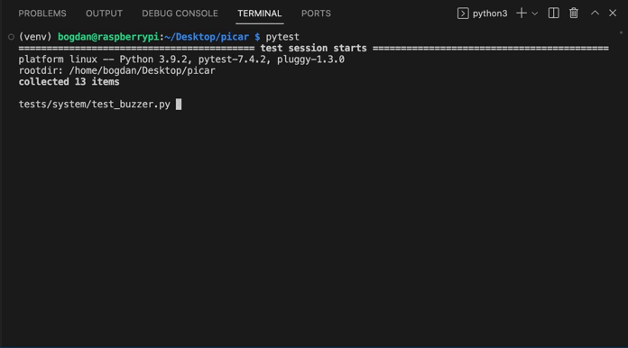

# RaspberryPi-car
Building a Raspberry Pi car, from putting it together to testing and adding remote control features.

### Current progress
- [x] Car assembly
- [x] System tests
- [ ] Car controller - IN PROGRESS
- [ ] UI for car controller - IN PROGRESS

## Getting started
1. Clone repository
   ```python
   git clone https://github.com/KyloRen1/RaspberryPi-car
   ```
2. Create python environment
   ```python
    python3 -m venv venv 
    source venv/bin/activate
    pip install -r requirements.txt
   ```
3. Run test
   ```python
    pytest
   ```


## System checks
Testing of the system for buzzer, ligths, wheels and turns, using pytest.

<div style="display:block;margin-top: 15px; margin-bottom: 30px" align="center">
    
    
</div>
